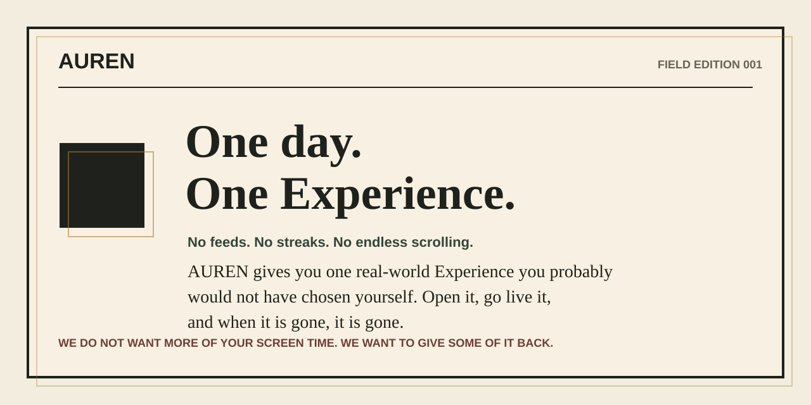
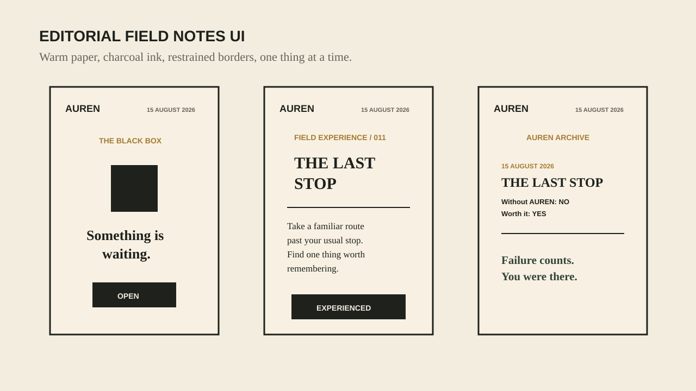
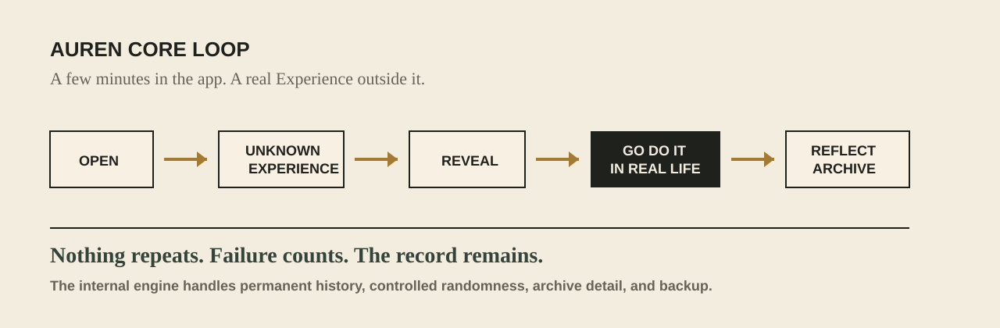

# AUREN

<p align="center">
  
</p>

<p align="center">
  <strong>One day. One real-world Experience. No feeds. No streaks. No repeats.</strong>
</p>

<p align="center">
  <code>Android</code>
  <code>Windows</code>
  <code>Offline-first</code>
  <code>No account</code>
  <code>No ads</code>
  <code>Encrypted backup</code>
</p>

AUREN gives you one carefully designed real-world Experience you probably would
not have chosen by default. Open it, go live it, return, reflect, and keep the
field note in your Archive.

Most apps ask for more of your attention.

AUREN tries to give some of it back.

## App Images

<p align="center">
  
</p>

<p align="center">
  
</p>

## What AUREN Is

AUREN is a real-life exploration app. It is not a course catalog, habit tracker,
productivity system, social network, personality test, or AI chatbot.

It gives you a real-world Experience, then gets out of the way.

You may be asked to observe something, repair something, explain something,
visit somewhere, make something, listen carefully, navigate differently, help
someone, or notice a part of life you usually pass by.

## How It Works

```text
OPEN
  -> REVEAL AN EXPERIENCE
  -> GO DO IT
  -> RETURN
  -> ANSWER TWO QUESTIONS
  -> SHARE IF YOU WANT
  -> ARCHIVE
```

Recommended rhythm: **one Experience a day**.

The app still lets you open another after completing or rejecting one, but AUREN
is designed to be used slowly. It is not an endless scroll.

## The Two Questions

After every Experience, AUREN asks:

```text
Would you have done this without AUREN?

Was it worth your time?
```

The best result is simple:

```text
NO

YES
```

That means AUREN helped you do something you probably would not have done
otherwise, and it was worth your time.

## What Makes It Different

- No feeds.
- No streaks.
- No XP.
- No levels.
- No leaderboards.
- No public proof of completion.
- No guilt for leaving.
- No browsing through a task catalog.
- No personality score or psychological label.

Failure counts. You were there.

## The Black Box

AUREN does not show you the whole catalog.

You open the Black Box, reveal one Experience, and decide whether to do it. Once
an Experience is revealed, it is gone for you forever. You will never receive
the same one twice.

If you reject an Experience, it still counts as revealed and will not return.

## Archive

Completed Experiences are saved as field notes.

In the Archive, you can open a completed Experience to see:

- the title
- the date
- the original task
- your reflection answers
- your private note, if you wrote one

Your Archive becomes a quiet record of what you actually experienced.

## Sharing

Sharing is optional and never rewarded.

After an Experience, AUREN offers one simple Share button. The shared text
includes the Experience title, the task, the date, and a short AUREN message.
Your private reflection answers and private notes are not included.

Example:

```text
AUREN
FIELD EXPERIENCE 0011
EXPERIENCED / 15 AUGUST 2026

------------------------------
TITLE
THE LAST STOP
------------------------------

TASK
Take a route you already know.
This time, stay on after your usual stop.

I experienced this through AUREN.
You do not have to succeed. You only have to experience it.
Failure counts. You were there.

One day. One Experience. No feeds. No streaks.
```

## Privacy

AUREN is private by design.

- No account is required.
- No internet connection is required after installation.
- No ads are included.
- No analytics are included.
- No GPS tracking is required.
- No contact access is required.
- No camera access is required.
- No public proof of completion is required.

Your exploration data stays on your device unless you choose to export a backup.

## Backup

AUREN supports encrypted `.aurenbackup` files.

You choose a passphrase, export the backup, and save it wherever you trust:

- local disk
- USB drive
- Google Drive folder
- OneDrive folder
- email
- another storage provider

To restore, choose the backup file and enter the same passphrase.

## Download And Install

Download the latest release from this repository's **Releases** page.

For Android:

1. Download `AUREN.apk`.
2. Open the APK on your phone.
3. If Android asks, allow installation from that source.
4. Open AUREN.

For Windows:

1. Download the Windows ZIP.
2. Extract the ZIP folder.
3. Open `auren.exe`.
4. If Windows SmartScreen appears, choose **More info** and then **Run anyway** only if you downloaded it from the official release page.

## Best Way To Use AUREN

Use it when you are willing to leave the screen.

Open one Experience. Do it honestly. Return when you are done. You do not have
to succeed. You only have to experience it.

## Safety

AUREN is designed for real life, not danger.

Respect safety, legality, dignity, accessibility, culture, and consent. Other
people are never props for an Experience.

## License

No license has been selected yet.
